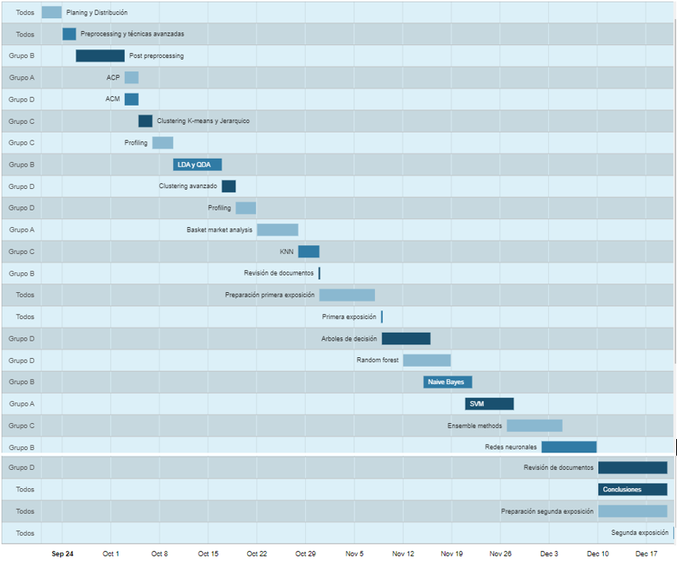

```{=tex}
\setlength{\headheight}{13.6pt}
\setlength{\topmargin}{-10mm}

\rhead{Minería de Datos}
\lhead{Entrega D2}
```
\pagestyle{fancy}
```{=tex}
\cfoot{\thepage}
\setcounter{page}{5}
```


```{r, include=FALSE}
#install.packages("googleVis")
library(googleVis)
```

# Plan de trabajo

## Diagrama de Gantt

A continuación se muestra la descomposición de la práctica en tareas i su debida secuenciación en un diagrama de Gantt. El equipo ha sido dividido en cuatro subgrupos para que la carga de tareas quede debidamente repartida entre todos los integrantes. Seguidamente se muestran los miembros de cada uno de estos grupos.

Grupo A: Aina Llaneras, Blanca Romero, Ivan Martínez

Grupo B: Iker Meneses, Alejandro Arcas, Alessandro Natali, Arnaut Goethals

Grupo C: Oscar Arroyo, Ismael Argemí, Mireia Bohils 

Grupo D: Marta Gómez, Mireia Bolívar, Berta Moyano


```{r, include=FALSE}
datTL <- data.frame(Position=c("Planing y Distribución","Preprocessing y técnicas avanzadas", "Post preprocessing", "ACP", "ACM", "Clustering K-means y Jerarquico", "Profiling" ,"LDA y QDA", "Clustering avanzado", "Profiling" , "Basket market analysis" , "KNN", "Revisión de documentos" ,"Preparación primera exposición", "Primera exposición", "Arboles de decisión", "Random forest", "Naive Bayes", "SVM", "Ensemble methods", "Redes neuronales","Revisión de documentos" ,"Conclusiones", "Preparación segunda exposición", "Segunda exposición"),
                    Name=c("Todos", "Todos", "Grupo B", "Grupo A", "Grupo D", "Grupo C", "Grupo C", "Grupo B","Grupo D", "Grupo D","Grupo A","Grupo C","Grupo B","Todos","Todos", "Grupo D","Grupo D","Grupo B", "Grupo A","Grupo C","Grupo B","Grupo D","Todos","Todos","Todos"),
                    start=as.Date(x=c("2023-09-21", "2023-09-24", "2023-09-26", "2023-10-03", "2023-10-03" , "2023-10-05","2023-10-07" ,"2023-10-10", "2023-10-17" , "2023-10-19" , "2023-10-22","2023-10-28" , "2023-10-31", "2023-10-31", "2023-11-09" , "2023-11-09", "2023-11-12" , "2023-11-15" , "2023-11-21" , "2023-11-27" , "2023-12-02", "2023-12-10" , "2023-12-10","2023-12-10" , "2023-12-21"),),
                    end=as.Date(x=c("2023-09-24", "2023-09-26", "2023-10-03", "2023-10-05","2023-10-05" , "2023-10-07", "2023-10-10", "2023-10-17" ,"2023-10-19" , "2023-10-22" ,"2023-10-28", "2023-10-31", "2023-10-31", "2023-11-08", "2023-11-09", "2023-11-16", "2023-11-19", "2023-11-22", "2023-11-28", "2023-12-05", "2023-12-10", "2023-12-20", "2023-12-20", "2023-12-20", "2023-12-21"),))

vec <- as.numeric(datTL$Name)

Timeline_Teoric <- gvisTimeline(data=datTL, 
                         rowlabel="Name",
                         barlabel="Position",
                         start="start", 
                         end="end",
                         options=list(timeline="{groupByRowLabel:false}",
                                      backgroundColor="#DCF0F8", 
                                      height=900,
                                      width=1300,
                                      colors="['#8AB8D0', '#307BA5', '#19506F']"),)
plot(Timeline_Teoric)

```

```{=tex}
\vspace{1cm}
\begin{center}
\textbf{Diagrama de Gantt}
\end{center}
```

```{=tex}
\begin{center}
```


```{=tex}
\end{center}
```

\newpage

## Análisis de riesgos

Se han identificado los siguientes riesgos que podrían afectar al
correcto desarrollo del trabajo:

+------------------------+--------------+---------------------------+
| Posible problema       | Probabilidad | Solución                  |
|                        | de suceso    |                           |
|                        |              |                           |
+========================+==============+===========================+
| Tarea crítica no       | Baja         | Establecer una fecha      |
| finalizada a tiempo    |              | límite previa para tener  |
|                        |              | margen de maniobra        |
+------------------------+--------------+---------------------------+
| Falta y/o errores de   | Alta         | Canales de comunicación   |
| comunicación entre los |              | claros y efectivos y      |
| miembros del grupo     |              | designar un líder por     |
|                        |              | equipo                    |
+------------------------+--------------+---------------------------+
| Error en una tarea     | Media        | Tareas iniciales          |
| inicial que impida la  |              | revisadas por miembros de |
| correcta evolución     |              | otros grupos              |
|                        |              |                           |
|                        |              | Asignar a dos grupos para |
|                        |              | que trabajen de forma     |
|                        |              | simultánea                |
+------------------------+--------------+---------------------------+
| Ausencia temporal de   | Alta         | Un subgrupo dará soporte  |
| algun membro del       |              | para la finalización de   |
| equipo                 |              | la tarea a tiempo         |
|                        |              |                           |
|                        |              | Correcta explicación del  |
|                        |              | avance realizado al       |
|                        |              | integrante que ha faltado |
|                        |              | temporalmente             |
+------------------------+--------------+---------------------------+
| Ausencia permanente de | Baja         | Reasignación de los       |
| algun mienbro del      |              | integrantes del subgrupo  |
| equipo                 |              | en otro y redistribución  |
|                        |              | de las tareas.            |
+------------------------+--------------+---------------------------+
| Falta de conocimiento  | Alta         | Revisar todos los avances |
| de tareas anteriores   |              | que se han realizado en   |
|                        |              | cada uno de los grupos    |
|                        |              |                           |
|                        |              | Asegurar que todos los    |
|                        |              | miembros de cada grupo    |
|                        |              | entiendan el proyecto     |
+------------------------+--------------+---------------------------+
| Falta de comprensión   | Baja         | Asegurar que los miembros |
| del proyecto           |              | del grupo se reúnan       |
|                        |              | regularmente              |
+------------------------+--------------+---------------------------+
| Dificultad a la hora   | Media        | Asegurar que todos los    |
| de interpretar las     |              | miembros entienden la     |
| conclusiones obtenidas |              | totalidad de los          |
|                        |              | resultados así como sus   |
|                        |              | interpretaciones e        |
|                        |              | imlicaciones.             |
+------------------------+--------------+---------------------------+
